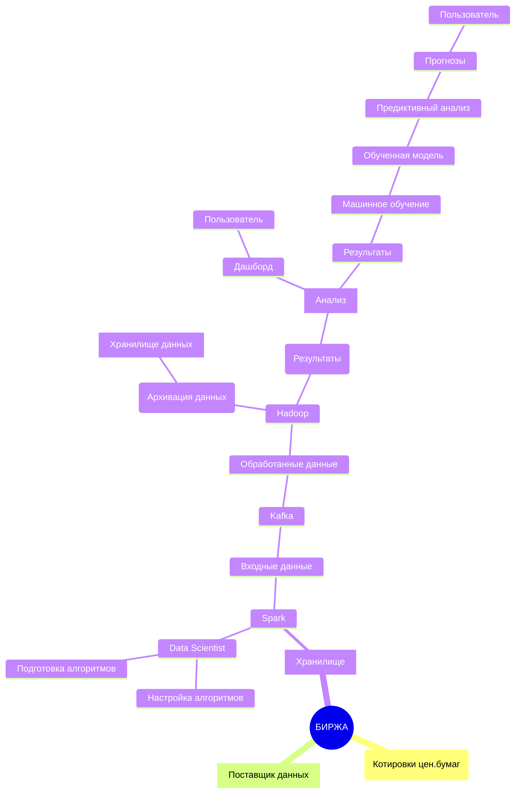
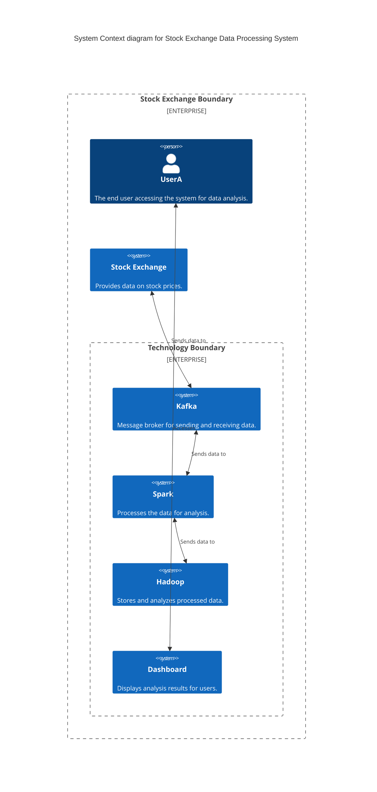

```mermaid
C4Container
    title Container diagram for Stock Exchange Data Processing System

    Container_Boundary(bourse, "Stock Exchange") {
        Container(data_provider, "Data Provider", "Provides stock quotes data", "REST API")
        Container(storage, "Data Storage", "Stores stock quotes data", "SQL Database")
        Container(data_processing, "Data Processing", "Processes data using Spark", "Spark")
        Container(message_queue, "Message Queue", "Handles incoming data", "Kafka")
        Container(data_analysis, "Data Analysis", "Stores and analyzes processed data", "Hadoop")
        Container(dashboard, "Dashboard", "Displays analysis results", "Web Application")
    }

    Rel(data_provider, storage, "Sends data to")
    Rel(storage, data_processing, "Sends data to")
    Rel(data_processing, message_queue, "Sends processed data to")
    Rel(message_queue, data_analysis, "Sends data to")
    Rel(data_analysis, dashboard, "Provides data to")
 ```                        
```mermaid
C4Component
    title Component diagram for Stock Exchange Data Processing System

    Container_Boundary(bourse, "Stock Exchange", "Provides stock quotes data") {
        Component(data_provider, "Data Provider", "REST API", "Provides stock quotes data")
        Component(storage, "Data Storage", "SQL Database", "Stores stock quotes data")
        Component(data_processing, "Data Processing", "Spark", "Processes data using Spark")
        Component(message_queue, "Message Queue", "Kafka", "Handles incoming data")
        Component(data_analysis, "Data Analysis", "Hadoop", "Stores and analyzes processed data")
        Component(dashboard, "Dashboard", "Web Application", "Displays analysis results")
    }

    Rel(data_provider, storage, "Sends data to")
    Rel(storage, data_processing, "Sends data to")
    Rel(data_processing, message_queue, "Sends processed data to")
    Rel(message_queue, data_analysis, "Sends data to")
    Rel(data_analysis, dashboard, "Provides data to")
``` 

