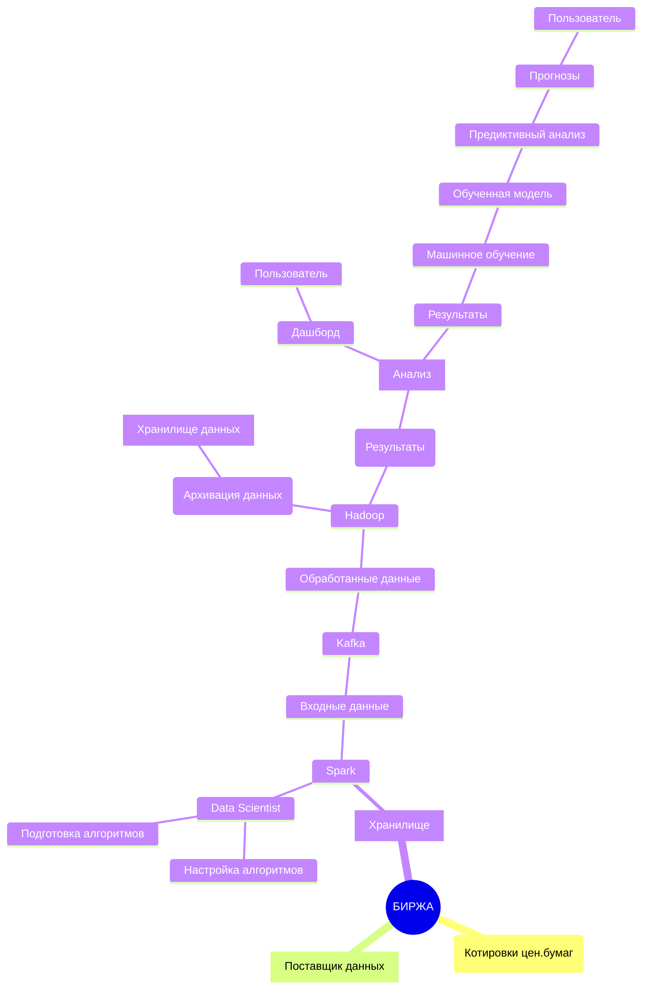
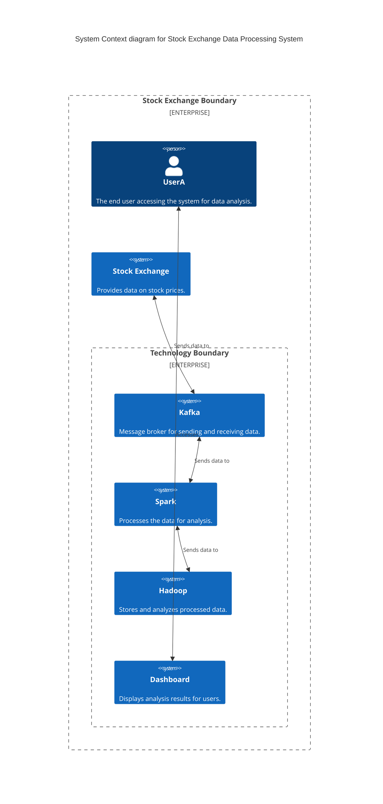

```mermaid
mindmap
  root((БИРЖА))
    (Котировки цен.бумаг)
    [Поставщик данных]  
    [Хранилище]
        Spark         
          Data Scientist
             Настройка алгоритмов
             Подготовка алгоритмов
         Входные данные
          Kafka
           Обработанные данные
            Hadoop
             (Результаты)
                [Анализ]
                  Дашборд
                    Пользователь
                  Результаты 
                    Машинное обучение
                        Обученная модель
                          Предиктивный анализ
                           Прогнозы
                            Пользователь
             (Архивация данных)
                [Хранилище данных]
          
```

```mermaid
C4Context

title System Context diagram for Stock Exchange Data Processing System

Enterprise_Boundary(b0, "Stock Exchange Boundary") {
    Person(User1, "UserA", "The end user accessing the system for data analysis.")

    System(SystemAA, "Stock Exchange", "Provides data on stock prices.") 

    Enterprise_Boundary(b1, "Technology Boundary") {
        System(Kafka, "Kafka", "Message broker for sending and receiving data.")
        System(Spark, "Spark", "Processes the data for analysis.")
        System(Hadoop, "Hadoop", "Stores and analyzes processed data.")
        System(Dashboard, "Dashboard", "Displays analysis results for users.")

        BiRel(User1, Dashboard, "Accesses")
        BiRel(SystemAA, Kafka, "Sends data to")
        BiRel(Kafka, Spark, "Sends data to")
        BiRel(Spark, Hadoop, "Sends data to")
    }
}
```

                            
