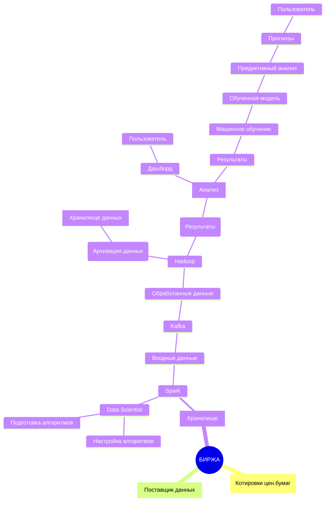
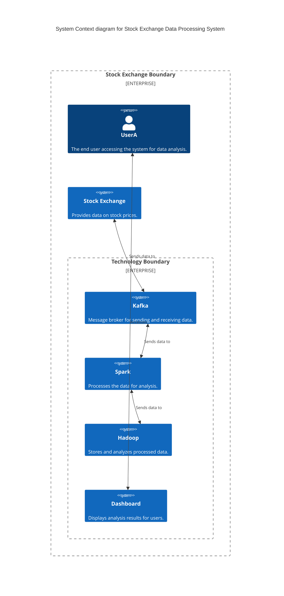

Описание кейса: 
Задача:
Необходимо получить данные о котировках ценных бумаг с биржи и далее передавать их в хранилища организации, обрабатывать и анализировать и выводить результаты анализа на дашборды.
Биржа предоставляет данные о котировках ценных бумаг.
Котировки ценных бумаг передаются в хранилище для хранения.
С помощью Spark данные обрабатываются.
Входные данные отправляются в Kafka для последующей обработки.
Обработанные данные передаются в Hadoop для хранения и анализа.
Результаты анализа доступны через дашборд для пользователей.



```mermaid
C4Container
    title Container diagram for Stock Exchange Data Processing System

    Container_Boundary(bourse, "Stock Exchange") {
        Container(data_provider, "Data Provider", "Provides stock quotes data", "REST API")
        Container(storage, "Data Storage", "Stores stock quotes data", "SQL Database")
        Container(data_processing, "Data Processing", "Processes data using Spark", "Spark")
        Container(message_queue, "Message Queue", "Handles incoming data", "Kafka")
        Container(data_analysis, "Data Analysis", "Stores and analyzes processed data", "Hadoop")
        Container(dashboard, "Dashboard", "Displays analysis results", "Web Application")
    }

    Rel(data_provider, storage, "Sends data to")
    Rel(storage, data_processing, "Sends data to")
    Rel(data_processing, message_queue, "Sends processed data to")
    Rel(message_queue, data_analysis, "Sends data to")
    Rel(data_analysis, dashboard, "Provides data to")
 ```                        
```mermaid
C4Component
title Component diagram for Stock Exchange Data Processing System
Container_Boundary(data_provider, "Data Provider", "Provides stock quotes data", "REST API") {
        Component(data_provider_api, "API", "RESTful API", "Provides data through REST API")
    }

    Container_Boundary(storage, "Data Storage", "Stores stock quotes data", "SQL Database") {
        Component(sql_database, "SQL Database", "Database for storing stock quotes data")
    }

    Container_Boundary(data_processing, "Data Processing", "Processes data using Spark", "Spark") {
        Component(spark_engine, "Spark Engine", "Spark processing engine")
        Component(data_transformation, "Data Transformation", "Transforms incoming data")
    }

    Container_Boundary(message_queue, "Message Queue", "Handles incoming data", "Kafka") {
        Component(kafka_queue, "Kafka Queue", "Message queue for handling data")
    }

    Container_Boundary(data_analysis, "Data Analysis", "Stores and analyzes processed data", "Hadoop") {
        Component(hadoop_storage, "Hadoop Storage", "Storage for processed data")
        Component(data_analysis_engine, "Analytics Engine", "Engine for analyzing data")
    }

    Container_Boundary(dashboard, "Dashboard", "Displays analysis results", "Web Application") {
        Component(web_frontend, "Web Frontend", "Frontend for displaying analytics results")
        Component(api_connector, "API Connector", "Connects to backend API")
    }


Rel(data_provider_api, sql_database, "Stores data in")
Rel(sql_database, spark_engine, "Processes data with")
Rel(spark_engine, kafka_queue, "Transfers processed data to")
Rel(kafka_queue, hadoop_storage, "Stores data in")
Rel(hadoop_storage, data_analysis_engine, "Analyzes data using")
Rel(data_analysis_engine, web_frontend, "Provides data to frontend")

``` 

